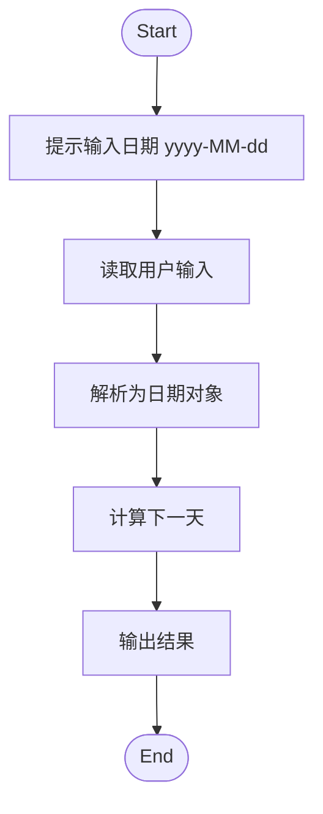
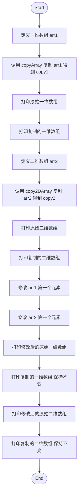

```mermaid
flowchart TD
    A([Start]) --> B[提示输入日期 yyyy-MM-dd]
    B --> C[读取用户输入]
    C --> D[解析为日期对象]
    D --> E[计算下一天]
    E --> F[输出结果]
    F --> G([End])

```

```mermaid
flowchart TD
    A([Start]) --> B[定义一维数组 arr1]
    B --> C[调用 copyArray 复制 arr1 得到 copy1]
    C --> D[打印原始一维数组]
    D --> E[打印复制的一维数组]

    E --> F[定义二维数组 arr2]
    F --> G[调用 copy2DArray 复制 arr2 得到 copy2]
    G --> H[打印原始二维数组]
    H --> I[打印复制的二维数组]

    I --> J[修改 arr1 第一个元素]
    J --> K[修改 arr2 第一个元素]
    K --> L[打印修改后的原始一维数组]
    L --> M[打印复制的一维数组 保持不变]
    M --> N[打印修改后的原始二维数组]
    N --> O[打印复制的二维数组 保持不变]
    O --> P([End])

```

